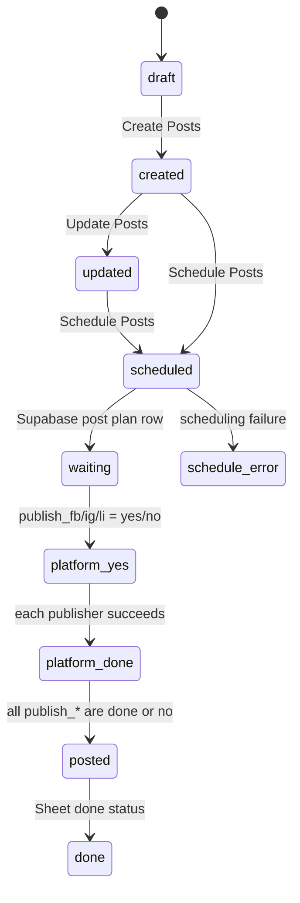

# Legacy Status And State Map

Date: 2026-05-15

## Purpose

This document maps how the legacy automation represents state.

Important framing: the current state model was pragmatic, not ideal. It mixed Google Sheets status text, Supabase status fields, per-platform publish flags, timestamps embedded in text, and n8n workflow side effects. It still provided a useful level of idempotency and operational visibility, especially through per-platform `publish_*` flags.

This document should be used as a reference for designing a cleaner product state machine later, not as a model to copy directly.

## High-Level Finding

The main social media automation uses two overlapping state layers:

1. **Google Sheets human-visible status**
   - shown in the planning/status column,
   - often includes a timestamp,
   - used by users as operational feedback.

2. **Supabase machine-ish scheduling state**
   - `some_post_plan_selfhost_external.status`,
   - `publish_fb`,
   - `publish_ig`,
   - `publish_li`,
   - used by n8n poll/publishing workflows to decide what to publish and whether all selected platforms are complete.

The most important idempotency-ish mechanism is:

- selected platforms start with `publish_* = 'yes'`,
- unselected platforms start with `publish_* = 'no'`,
- each successful platform publisher sets its own flag to `done`,
- the poll workflow treats the post as fully complete only when all flags are either `done` or `no`,
- then aggregate `status` becomes `posted`.

## Main Social Media Status Sources

## Apps Script Status Constants

Source: `appscripts/SoMe_main.txt`

Defined status constants:

```js
const STATUS = {
  DRAFT: "draft",
  SEND_TO_SOME: "send to some",
  CREATED: "created",
  UPDATE: "update",
  UPDATED: "updated",
  SCHEDULED: "scheduled",
  UPDATE_SCHEDULED: "update scheduled",
  DONE: "done"
};
```

Observed behavior:

- `draft` is initialized into the Sheet status column when a row has content and no status.
- Other constants describe intended lifecycle states but are not consistently used as pure machine states.
- Some n8n workflow writes include timestamps directly inside the status text.

## Google Sheets Main Status Column

Legacy display column:

- `FÁZE PLÁNOVÁNÍ` / encoded variants in export.

Known values written by workflows:

- `draft`
- `created (timestamp)`
- `updated (timestamp)`
- `scheduled (timestamp)`
- `Error in scheduling: ...`
- `done` in some older/branch flow references

Current writers:

- Apps Script initialization writes `draft`.
- `SoMe_Automation_Create_Post_ext` writes `created (...)` or `updated (...)`.
- `SoMe_Automation_Schedule_Post_ext` writes `scheduled (...)`.
- `SoMe_Automation_Schedule_Post_ext` can write scheduling error to Sheet.
- `SoMe_Scheduling_Poll_ext` updates done status in Sheet after aggregate completion.

Product implication:

- Human-readable display status should be separate from machine state.
- Timestamps should be separate columns/events, not embedded in the status string.

## Supabase Main Schedule Table

Table:

- `some_post_plan_selfhost_external`

Relevant fields:

- `status text`
- `publish_fb text`
- `publish_ig text`
- `publish_li text`
- planned dates/times per platform
- platform attachments
- platform captions
- `source_row`
- `user_id`

## Social Scheduling Initialization

Workflow:

- `Social_media_manager_workflows/SoMe_Automation_Schedule_Post_ext.json`

When a user schedules content, n8n creates a row in `some_post_plan_selfhost_external`.

Initial values:

- `status = waiting`
- `publish_fb = yes` if Facebook selected, otherwise `no`
- `publish_ig = yes` if Instagram selected, otherwise `no`
- `publish_li = yes` if LinkedIn selected, otherwise `no`

The same workflow writes `scheduled (timestamp)` to Google Sheets.

Meaning:

- `waiting` means scheduled/ready for polling.
- `yes` means this platform should be published.
- `no` means this platform is intentionally skipped and should not block aggregate completion.

Practical idempotency value:

- A re-run can inspect platform flags.
- Already skipped platforms do not block completion.
- Done platforms should not need to run again if the workflow respects the flags.

Fragility:

- `yes/no/done` are strings with no constraint.
- There is no per-platform error state.
- There is no attempt count or last error per platform.
- Aggregate `status` and platform flags can drift.

## Social Publishing Poll

Workflow:

- `Social_media_manager_workflows/SoMe_Scheduling_Poll_ext.json`

Triggers:

- daily schedule trigger,
- manual trigger,
- webhook `ext_Publish`.

Query logic:

- Facebook branch gets rows where `publish_fb = yes`.
- Instagram branch gets rows where `publish_ig = yes`.
- LinkedIn branch gets rows where `publish_li = yes`.

Then each branch:

- waits until the platform-specific scheduled time,
- executes the platform-specific publisher workflow.

Completion check:

```js
['publish_fb', 'publish_ig', 'publish_li']
  .every(key => ['done', 'no'].includes($json[key]))
```

If true:

- update `some_post_plan_selfhost_external.status = posted`,
- update done status in Google Sheets.

Meaning:

- all selected platforms have published successfully (`done`),
- all unselected platforms are ignored (`no`),
- the aggregate row is considered posted.

Product implication:

- This should become one `publication_job` per platform.
- Aggregate content status should be derived from job statuses rather than manually stored as a loosely synchronized field.

## Platform Publisher Completion

### Facebook Publisher

Workflow:

- `Social_media_manager_workflows/SoMe_Automation_Post_Facebook_ext.json`

On successful publishing:

- updates `some_post_plan_selfhost_external.publish_fb = done`.

Some branches also update a Google Sheet row with `Status = done`.

Known publish branches:

- photo,
- multiple images/feed,
- video.

Current missing states:

- no explicit `publishing`,
- no explicit `failed`,
- no platform result table,
- no normalized external post URL in the main social table.

### Instagram Publisher

Workflow:

- `Social_media_manager_workflows/SoMe_Automation_Post_Instagram_ext.json`

On successful publishing:

- updates `some_post_plan_selfhost_external.publish_ig = done`.

Known publish branches:

- single file,
- multiple images/carousel,
- video.

Current missing states:

- no explicit carousel container readiness state,
- no explicit failure state,
- no result URL/id storage in the main table.

### LinkedIn Publisher

Workflow:

- `Social_media_manager_workflows/SoMe_Automation_Post_LinkedIn_ext.json`

On successful publishing:

- updates `some_post_plan_selfhost_external.publish_li = done`.

Known publish branches:

- text/image,
- video,
- asset registration/upload,
- UGC publish.

Current missing states:

- no explicit upload registered/uploaded/published sub-state,
- no external URL storage in the main social table,
- no explicit failure state.

## Update Planned Post

Workflow:

- `Social_media_manager_workflows/SoMe_Automation_Update_Planned_Post_ext.json`

Observed behavior:

- updates fields in `some_post_plan_selfhost_external`,
- updates status in Google Sheets,
- does not appear to reset `publish_fb`, `publish_ig`, `publish_li` in the exported field list.

Risk:

- updating a scheduled post after one platform already published could create inconsistent state unless guarded operationally.

Product implication:

- the product should define whether scheduled/published variants are editable,
- if editable, edits should create a new revision or require re-approval,
- already-published jobs should be immutable except for metadata/result sync.

## Create / Update Post Variants

Workflow:

- `Social_media_manager_workflows/SoMe_Automation_Create_Post_ext.json`

Google Sheets status write:

- if `action_name === 'Create Posts'`, writes `created (timestamp)`,
- otherwise writes `updated (timestamp)`.

Meaning:

- content has been generated or regenerated,
- preview was created,
- row is ready for review/approval by the user.

Product mapping:

- `created` / `updated` should map to variant generation/edit events,
- likely `content_items.status = ready_for_review`,
- `platform_variants.status = ready_for_review`.

## Main Social State Lifecycle, Reconstructed

Approximate current lifecycle:



Notes:

- `scheduled` is mostly a Sheet display state.
- `waiting` is the Supabase schedule-table state.
- `posted` is the Supabase aggregate state.
- `done` appears as a platform flag and in some Sheet writes.
- There is no formal state machine enforcement.

## Solo LinkedIn State Map

Location:

- `Linkedin_solo_workflows/`

The solo LinkedIn branch has a simpler, more explicit state sequence.

Known statuses:

- `GENERATED`
- `REGENERATED`
- `EDITED`
- `CONFIRMED`
- `DONE`

### Generate

Workflow:

- `LI-Generate`

Writes:

- `LinkedIn_manager_posts.status = GENERATED`
- generated LinkedIn text,
- scheduled_at from payload,
- Google Sheet `Status`.

### Regenerate

Workflow:

- `LI-Regenerate`

Writes:

- `status = REGENERATED`
- updated LinkedIn text,
- Google Sheet `Status`.

### Edit

Workflow:

- `LI-Edit`

Writes:

- `status = EDITED`
- edited LinkedIn text,
- scheduled_at,
- Google Sheet `Status`.

### Confirm

Workflow:

- `LI-Confirm`

Writes:

- `status = CONFIRMED`
- Google Sheet `Status`.

### Publish

Workflow:

- `LinkedIn_Scheduling_Poll`

Selection:

- gets rows where `status = CONFIRMED`.

On success:

- sets `status = DONE`,
- writes `link_to_post`,
- writes Sheet `Result_url`.

Product lesson:

- This branch has a clearer single-platform lifecycle than the main social flow.
- It may be useful as a conceptual reference for per-platform `publication_jobs`.

Owner input still needed:

- which parts of this LinkedIn flow are known to be more reliable in practice,
- especially media upload/publish behavior.

## Newsletter State Map

Newsletter is client-specific reference only.

Known statuses:

- `READY IN ODOO`
- `POSTED`
- `DONE`
- `ERROR`

### Post To Odoo

Workflow:

- `Recieve_Post_Command`

Google Sheets:

- writes `status = READY IN ODOO`.

Workflow:

- `Post to Odoo`

Supabase:

- updates `newsletter_drafts.status = POSTED`,
- stores `odoo_post_id`.

### Confirm And Send

Workflow:

- `Confirm_and_Send`

Google Sheets:

- writes `status = DONE` on success,
- writes `status = ERROR` on failure.

Product lesson:

- Newsletter has an external-platform handoff state (`READY IN ODOO`) that is conceptually similar to publication job handoff.
- Do not copy newsletter states into social MVP directly.

## Problems In Legacy State Logic

Main issues:

- state is split across Google Sheets and Supabase,
- display state and machine state are mixed,
- timestamps are embedded in status strings,
- per-platform flags use free-form strings,
- no explicit failure state per platform,
- no attempt count/retry tracking,
- no normalized publication result table,
- no idempotency key,
- no revision model for update-after-schedule,
- no constraints preventing invalid transitions,
- selected platform state is encoded as `yes/no/done` rather than separate jobs.

What worked reasonably well:

- skipped platforms use `no`,
- selected platforms use `yes`,
- successful publishers mark platform as `done`,
- aggregate completion waits until all flags are `done` or `no`,
- Sheet remains readable for operators,
- simple status text was easy to inspect manually.

## Recommended Product State Model

### Content Item Status

Recommended normalized values:

- `idea`
- `draft`
- `generating`
- `ready_for_review`
- `changes_requested`
- `approved`
- `scheduled`
- `partially_published`
- `published`
- `failed`
- `archived`

### Platform Variant Status

Recommended normalized values:

- `draft`
- `generating`
- `ready_for_review`
- `changes_requested`
- `approved`
- `scheduled`
- `published`
- `failed`
- `archived`

### Publication Job Status

Recommended normalized values:

- `draft`
- `scheduled`
- `queued`
- `publishing`
- `published`
- `failed`
- `cancelled`
- `skipped`

Legacy mapping:

| Legacy value | New model |
| --- | --- |
| Sheet `draft` | `content_items.status = draft` |
| Sheet `created (...)` | `ready_for_review` + activity log event |
| Sheet `updated (...)` | `ready_for_review` + activity log event |
| Sheet `scheduled (...)` | `scheduled` + publication jobs |
| Supabase `waiting` | `publication_jobs.status = scheduled` |
| `publish_* = yes` | platform job exists and is `scheduled` |
| `publish_* = no` | no job, or job status `skipped` if explicit tracking needed |
| `publish_* = done` | platform job `published` |
| Supabase `posted` | aggregate content `published` if all jobs published/skipped |
| Sheet `Error in scheduling` | `publication_jobs.status = failed` + activity log |
| Solo LI `GENERATED` | variant `ready_for_review` |
| Solo LI `REGENERATED` | variant `ready_for_review` with new automation run |
| Solo LI `EDITED` | variant `ready_for_review` or `draft`, depending on review requirement |
| Solo LI `CONFIRMED` | variant/content `approved` |
| Solo LI `DONE` | publication job `published` |

## Recommended Transition Rules

Initial product rules:

- content can move `draft -> generating -> ready_for_review`,
- approval can move `ready_for_review -> approved`,
- request changes can move `ready_for_review -> changes_requested`,
- scheduling requires `approved`,
- scheduling creates one `publication_job` per selected platform,
- each job moves independently,
- aggregate content status is derived:
  - all jobs scheduled -> `scheduled`,
  - some jobs published -> `partially_published`,
  - all jobs published/skipped -> `published`,
  - any terminal failure -> `failed` or `partially_published` with failed job, depending on policy.

Do not embed timestamps in status values.

Use:

- `created_at`,
- `updated_at`,
- `queued_at`,
- `started_at`,
- `finished_at`,
- `published_at`,
- `activity_logs`.

## Audit Notes For Later Implementation

When implementing:

- create DB constraints or app-level validation for status values,
- use one publication job per platform,
- add idempotency key per job,
- store platform result IDs and URLs,
- store per-job error details,
- keep raw API responses in `publication_results.raw_response`,
- avoid updating aggregate content state directly from platform publishers unless done through a controlled server action.

## Open Questions

Need owner input later:

1. Should a platform failure mark the whole content item as `failed`, or `partially_published`?
2. Should scheduled jobs be editable before publish?
3. If a scheduled job is edited, does it require re-approval?
4. Do skipped platforms need explicit `skipped` jobs, or is absence of job enough?
5. Should approval be per content item or per platform variant in the first version?
6. Should publication retry be automatic or manual in MVP?
