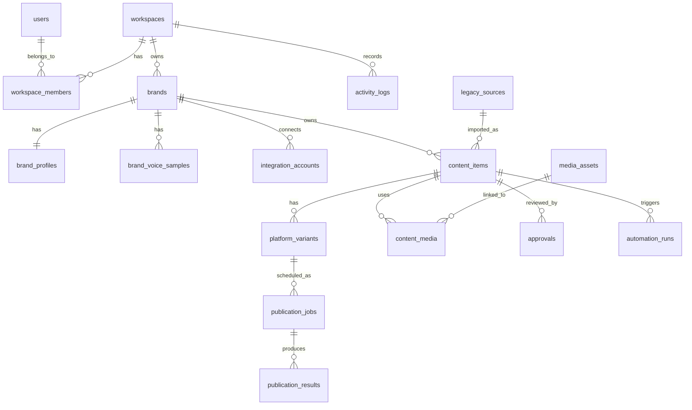

# Target Data Model

Date: 2026-05-14

## Purpose

This document proposes the first clean product data model for Social Media Manager productization.

The model is designed for:

- local Postgres first,
- future remote Postgres or Supabase migration,
- a separate product implementation,
- selective reuse of legacy workflow knowledge,
- social media orchestration MVP,
- future extension to blog/newsletter without baking client-specific newsletter logic into the core.

## Design Principles

1. Use product concepts, not Google Sheets concepts.
2. Keep legacy IDs only as references, never as primary product identity.
3. Split master content from platform variants.
4. Split approved content from publication jobs.
5. Track automation runs and activity logs explicitly.
6. Keep credentials behind a server boundary.
7. Keep the schema Postgres-native and portable.
8. Avoid Supabase-only assumptions in the base model.
9. Make future multi-tenant/team support possible from day one.
10. Keep MVP simple enough to build.

## Core Entity Overview

Recommended first entities:

- `users`
- `workspaces`
- `workspace_members`
- `brands`
- `brand_profiles`
- `brand_voice_samples`
- `integration_accounts`
- `content_items`
- `platform_variants`
- `media_assets`
- `content_media`
- `approvals`
- `publication_jobs`
- `publication_results`
- `automation_runs`
- `activity_logs`
- `legacy_sources`

Future entities:

- `campaigns`
- `content_lifecycle_rules`
- `repurposing_jobs`
- `prompt_templates`
- `teams`
- `comments`
- `notifications`
- `billing_customers`

## Suggested ERD



## Enum-Like Values

Use Postgres enums later if useful, but for early iteration I recommend `text` columns with check constraints or application validation. This keeps migrations easier while the product shape is still changing.

### Platforms

Initial:

- `instagram`
- `facebook`
- `linkedin`

Later:

- `blog`
- `newsletter`
- `tiktok`
- `youtube`
- `x`

### Content Status

For `content_items.status`:

- `idea`
- `draft`
- `generating`
- `ready_for_review`
- `changes_requested`
- `approved`
- `scheduled`
- `partially_published`
- `published`
- `failed`
- `archived`

### Variant Status

For `platform_variants.status`:

- `draft`
- `generating`
- `ready_for_review`
- `changes_requested`
- `approved`
- `scheduled`
- `published`
- `failed`
- `archived`

### Publication Job Status

For `publication_jobs.status`:

- `draft`
- `scheduled`
- `queued`
- `publishing`
- `published`
- `failed`
- `cancelled`
- `skipped`

### Approval Status

For `approvals.status`:

- `pending`
- `approved`
- `changes_requested`
- `rejected`
- `cancelled`

### Media Type

For `media_assets.media_type`:

- `image`
- `video`
- `document`
- `html_preview`
- `other`

### Media Source

For `media_assets.source`:

- `uploaded`
- `generated`
- `imported`
- `legacy_drive`
- `external_url`

## Tables

## `users`

Represents application users.

If Supabase Auth is used later, `users.id` can mirror `auth.users.id`. For portability, keep it as a normal UUID in the product schema and map auth provider IDs explicitly.

Suggested columns:

- `id uuid primary key`
- `email text unique not null`
- `display_name text`
- `avatar_url text`
- `auth_provider text`
- `auth_provider_user_id text`
- `created_at timestamptz not null`
- `updated_at timestamptz not null`

Notes:

- For the first local prototype, this can be seeded manually or simplified.
- Do not store password hashes here if using an auth provider.

## `workspaces`

Top-level tenant/project container.

Suggested columns:

- `id uuid primary key`
- `name text not null`
- `slug text unique`
- `status text not null default 'active'`
- `created_at timestamptz not null`
- `updated_at timestamptz not null`

Notes:

- Even if MVP starts single-workspace, include this now to avoid painful later migration.

## `workspace_members`

Maps users to workspaces.

Suggested columns:

- `id uuid primary key`
- `workspace_id uuid not null references workspaces(id)`
- `user_id uuid not null references users(id)`
- `role text not null`
- `created_at timestamptz not null`
- `updated_at timestamptz not null`

Suggested roles:

- `owner`
- `admin`
- `editor`
- `approver`
- `viewer`

Constraints:

- unique `(workspace_id, user_id)`

## `brands`

Represents a managed brand/client inside a workspace.

Suggested columns:

- `id uuid primary key`
- `workspace_id uuid not null references workspaces(id)`
- `name text not null`
- `slug text`
- `website_url text`
- `default_language text`
- `status text not null default 'active'`
- `created_at timestamptz not null`
- `updated_at timestamptz not null`

Constraints:

- unique `(workspace_id, slug)`

Notes:

- A workspace can have one or more brands.

## `brand_profiles`

Structured brand onboarding and brand voice capture.

Suggested columns:

- `id uuid primary key`
- `brand_id uuid not null unique references brands(id)`
- `description text`
- `target_audience text`
- `products_services text`
- `tone_of_voice text`
- `preferred_style text`
- `forbidden_phrases text[]`
- `content_pillars text[]`
- `cta_preferences jsonb`
- `language_preferences jsonb`
- `approval_rules jsonb`
- `publishing_frequency jsonb`
- `platform_rules jsonb`
- `created_at timestamptz not null`
- `updated_at timestamptz not null`

Suggested `platform_rules` shape:

```json
{
  "instagram": {
    "caption_style": "short, visual, friendly",
    "hashtags": "use selectively",
    "emoji_policy": "low"
  },
  "facebook": {
    "caption_style": "community-oriented"
  },
  "linkedin": {
    "caption_style": "expert, clear, less casual"
  }
}
```

Notes:

- Keep complex onboarding answers as `jsonb` where structure may evolve.
- Keep high-value queryable fields as direct columns.

## `brand_voice_samples`

Existing posts or examples used to infer brand voice.

Suggested columns:

- `id uuid primary key`
- `brand_id uuid not null references brands(id)`
- `platform text`
- `title text`
- `content text not null`
- `source_url text`
- `language text`
- `notes text`
- `created_at timestamptz not null`

Notes:

- Can later feed embeddings/vector search, but do not require that in MVP.

## `integration_accounts`

Represents connected external accounts/pages/profiles.

Suggested columns:

- `id uuid primary key`
- `brand_id uuid not null references brands(id)`
- `platform text not null`
- `account_type text`
- `external_account_id text`
- `external_account_name text`
- `status text not null default 'connected'`
- `scopes text[]`
- `connected_at timestamptz`
- `last_validated_at timestamptz`
- `expires_at timestamptz`
- `metadata jsonb`
- `created_at timestamptz not null`
- `updated_at timestamptz not null`

Constraints:

- unique `(brand_id, platform, external_account_id)`

Credential handling:

- Do not store access tokens directly in this table in plaintext.
- For local MVP, use an encrypted/separate credential table or environment-secret mapping.
- Long term, use secret manager or encrypted columns.

Product mapping from legacy:

- `SoMe_user_db.fb_page_id` -> `external_account_id` for Facebook.
- `SoMe_user_db.ig_user_id` -> `external_account_id` for Instagram.
- `SoMe_user_db.linkedin_user_id` -> `external_account_id` for LinkedIn.

## `integration_credentials`

Optional table if credentials are stored in Postgres during local MVP.

Suggested columns:

- `id uuid primary key`
- `integration_account_id uuid not null references integration_accounts(id)`
- `credential_type text not null`
- `encrypted_value text not null`
- `expires_at timestamptz`
- `created_at timestamptz not null`
- `updated_at timestamptz not null`

Important:

- This table must not be readable by the frontend.
- If using Supabase later, RLS should deny all client access.
- Prefer server-only access.

Alternative:

- Store only `secret_ref text` on `integration_accounts` and keep secrets outside the DB.

## `content_items`

Master content object. This is the product replacement for one logical content row in Google Sheets.

Suggested columns:

- `id uuid primary key`
- `workspace_id uuid not null references workspaces(id)`
- `brand_id uuid not null references brands(id)`
- `created_by_user_id uuid references users(id)`
- `title text`
- `master_content text`
- `brief text`
- `content_type text not null default 'post'`
- `status text not null default 'draft'`
- `source text not null default 'manual'`
- `campaign_id uuid`
- `language text`
- `target_audience text`
- `content_pillars text[]`
- `generation_context jsonb`
- `metadata jsonb`
- `created_at timestamptz not null`
- `updated_at timestamptz not null`
- `archived_at timestamptz`

Suggested `content_type` values:

- `post`
- `story`
- `repost`
- `blog`
- `newsletter`
- `campaign_asset`

Notes:

- `master_content` can be empty for idea/brief-only generation.
- Keep `brief` separate from final copy.
- `generation_context` can store one-off instructions used for AI runs.

Legacy mapping:

- one `SoMe_content` row -> one `content_item`.
- Apps Script `user_input` -> `generation_context` or automation run input.
- Sheet `status` -> normalized `content_items.status`.

## `platform_variants`

Platform-specific copy and publishing settings.

Suggested columns:

- `id uuid primary key`
- `content_item_id uuid not null references content_items(id)`
- `platform text not null`
- `integration_account_id uuid references integration_accounts(id)`
- `status text not null default 'draft'`
- `caption text`
- `headline text`
- `credits text`
- `hashtags text[]`
- `cta_label text`
- `cta_url text`
- `language text`
- `scheduled_for timestamptz`
- `platform_options jsonb`
- `ai_model text`
- `generation_prompt_version text`
- `created_at timestamptz not null`
- `updated_at timestamptz not null`

Constraints:

- unique `(content_item_id, platform)` for MVP.

Notes:

- Later, allow multiple variants per platform by adding `variant_key` or removing uniqueness.
- `platform_options` can hold IG carousel settings, LinkedIn visibility, FB link/photo mode, etc.

Legacy mapping:

- `caption_instagram` -> Instagram variant `caption`.
- `caption_facebook` -> Facebook variant `caption`.
- `caption_linkedin` -> LinkedIn variant `caption`.
- `hashtags` -> Instagram/Facebook hashtag array or platform option.
- platform planned date/time -> `scheduled_for`.

## `media_assets`

Represents uploaded, generated, imported, or legacy media files.

Suggested columns:

- `id uuid primary key`
- `workspace_id uuid not null references workspaces(id)`
- `brand_id uuid references brands(id)`
- `uploaded_by_user_id uuid references users(id)`
- `source text not null`
- `media_type text not null`
- `storage_provider text not null`
- `storage_bucket text`
- `storage_path text`
- `public_url text`
- `external_url text`
- `filename text`
- `mime_type text`
- `size_bytes bigint`
- `width int`
- `height int`
- `duration_seconds numeric`
- `alt_text text`
- `metadata jsonb`
- `created_at timestamptz not null`
- `updated_at timestamptz not null`

Suggested `storage_provider` values:

- `local`
- `supabase`
- `s3`
- `google_drive`
- `external`

Notes:

- For local MVP, uploaded files can be stored locally or in a mounted Docker volume.
- If using Supabase Storage later, map `storage_bucket` and `storage_path`.

Legacy mapping:

- Google Drive media URLs -> `source = 'legacy_drive'`, `storage_provider = 'google_drive'`.
- Supabase Storage uploaded files -> `storage_provider = 'supabase'`.
- generated images -> `source = 'generated'`.

## `content_media`

Join table assigning media to content and/or platform variants.

Suggested columns:

- `id uuid primary key`
- `content_item_id uuid not null references content_items(id)`
- `platform_variant_id uuid references platform_variants(id)`
- `media_asset_id uuid not null references media_assets(id)`
- `platform text`
- `role text`
- `sort_order int not null default 0`
- `created_at timestamptz not null`

Suggested `role` values:

- `primary`
- `gallery`
- `carousel_item`
- `video`
- `thumbnail`
- `preview`

Notes:

- `platform_variant_id` can be null when asset belongs to master content.
- `platform` can be denormalized for easier filtering.

Legacy mapping:

- `instagram_attachments`, `facebook_attachments`, `linkedin_attachments` arrays become rows in `content_media`.

## `approvals`

Review and approval history.

Suggested columns:

- `id uuid primary key`
- `content_item_id uuid not null references content_items(id)`
- `platform_variant_id uuid references platform_variants(id)`
- `requested_by_user_id uuid references users(id)`
- `reviewed_by_user_id uuid references users(id)`
- `status text not null default 'pending'`
- `comment text`
- `created_at timestamptz not null`
- `reviewed_at timestamptz`

Notes:

- Approval can happen at content level or per platform variant.
- MVP can start with simple approve/reject/change request.

Product question:

- Should approval be per whole content item or per platform? Recommendation: support both in schema, use whole item in MVP unless platform-specific approval is needed immediately.

## `publication_jobs`

Represents a scheduled or requested publication action.

Suggested columns:

- `id uuid primary key`
- `content_item_id uuid not null references content_items(id)`
- `platform_variant_id uuid not null references platform_variants(id)`
- `integration_account_id uuid references integration_accounts(id)`
- `platform text not null`
- `status text not null default 'draft'`
- `scheduled_for timestamptz`
- `queued_at timestamptz`
- `started_at timestamptz`
- `finished_at timestamptz`
- `attempt_count int not null default 0`
- `next_retry_at timestamptz`
- `idempotency_key text`
- `last_error text`
- `created_by_user_id uuid references users(id)`
- `created_at timestamptz not null`
- `updated_at timestamptz not null`

Constraints:

- unique `(idempotency_key)` where not null.

Notes:

- This replaces `some_post_plan_selfhost_external` as a normalized publishing queue.
- Create one job per platform variant.
- A single content item can have several jobs.

Legacy mapping:

- one row in `some_post_plan_selfhost_external` can become up to three `publication_jobs`.
- `publish_fb`, `publish_ig`, `publish_li` become per-job statuses.

## `publication_results`

Stores platform output for a publication job.

Suggested columns:

- `id uuid primary key`
- `publication_job_id uuid not null references publication_jobs(id)`
- `platform text not null`
- `external_post_id text`
- `external_url text`
- `raw_response jsonb`
- `status text not null`
- `error_code text`
- `error_message text`
- `created_at timestamptz not null`

Notes:

- Keep raw API response for debugging.
- Normalize common fields for product UI.

## `automation_runs`

Tracks AI/n8n/server automation executions.

Suggested columns:

- `id uuid primary key`
- `workspace_id uuid not null references workspaces(id)`
- `brand_id uuid references brands(id)`
- `content_item_id uuid references content_items(id)`
- `platform_variant_id uuid references platform_variants(id)`
- `publication_job_id uuid references publication_jobs(id)`
- `run_type text not null`
- `provider text not null`
- `external_run_id text`
- `status text not null`
- `input jsonb`
- `output jsonb`
- `error text`
- `started_at timestamptz`
- `finished_at timestamptz`
- `created_at timestamptz not null`

Suggested `run_type` values:

- `generate_variants`
- `edit_variant`
- `generate_image`
- `schedule_publication`
- `publish`
- `validate_credentials`
- `import_legacy`

Suggested `provider` values:

- `n8n`
- `app_server`
- `ai_provider`
- `manual`

Notes:

- This is the product-native replacement for n8n/Sheet log coupling.
- Store enough input/output to debug without exposing secrets.

## `activity_logs`

User-visible audit trail.

Suggested columns:

- `id uuid primary key`
- `workspace_id uuid not null references workspaces(id)`
- `brand_id uuid references brands(id)`
- `actor_user_id uuid references users(id)`
- `entity_type text not null`
- `entity_id uuid`
- `action text not null`
- `message text`
- `metadata jsonb`
- `created_at timestamptz not null`

Examples:

- content created,
- variants generated,
- approval requested,
- changes requested,
- post scheduled,
- publish failed,
- publish succeeded.

## `legacy_sources`

Stores references back to imported legacy objects.

Suggested columns:

- `id uuid primary key`
- `workspace_id uuid not null references workspaces(id)`
- `source_type text not null`
- `source_system text not null`
- `external_id text`
- `external_url text`
- `metadata jsonb`
- `created_at timestamptz not null`

Suggested `source_type` values:

- `google_sheet`
- `google_sheet_row`
- `google_drive_folder`
- `google_drive_file`
- `n8n_workflow`
- `supabase_row`

Notes:

- Useful for migration/import and debugging.
- Do not make legacy source references required for new product content.

## MVP Schema Cut

For the first frontend MVP, build only:

- `users`
- `workspaces`
- `workspace_members`
- `brands`
- `brand_profiles`
- `brand_voice_samples`
- `integration_accounts`
- `content_items`
- `platform_variants`
- `media_assets`
- `content_media`
- `approvals`
- `publication_jobs`
- `publication_results`
- `automation_runs`
- `activity_logs`
- `legacy_sources`

Defer:

- campaigns,
- comments,
- notification preferences,
- billing,
- advanced lifecycle automation,
- embeddings/vector search,
- newsletter-specific tables.

## Legacy-To-Target Mapping

### Google Sheet `SoMe_content`

| Legacy Field | Target |
| --- | --- |
| `ID` | `legacy_sources.external_id` or `content_items.metadata.legacy_row_id` |
| `TEXT_IG` | `platform_variants.caption` where platform = `instagram` |
| `CREDITS_IG` | `platform_variants.credits` where platform = `instagram` |
| `HASHTAGS_IG` | `platform_variants.hashtags` |
| `TEXT_FB` | `platform_variants.caption` where platform = `facebook` |
| `CREDITS_FB` | `platform_variants.credits` where platform = `facebook` |
| `TEXT_LI` | `platform_variants.caption` where platform = `linkedin` |
| `PHOTOS_LINK` | `legacy_sources` and `media_assets` |
| planned dates/times | `platform_variants.scheduled_for` and `publication_jobs.scheduled_for` |
| `STATUS` | `content_items.status` / `platform_variants.status` |
| `PREVIEW` | `media_assets` with `media_type = 'html_preview'` |
| `IMAGES` | media existence/source mode |

### Supabase `SoMe_user_db`

| Legacy Field | Target |
| --- | --- |
| `user_name` | `users.display_name` or `brands.name` depending on actual meaning |
| `reference_email` | `users.email` or workspace contact metadata |
| `fb_page_id` | `integration_accounts.external_account_id` |
| `ig_user_id` | `integration_accounts.external_account_id` |
| `linkedin_user_id` | `integration_accounts.external_account_id` |
| tokens | `integration_credentials` or secret manager |
| `master_table_id` | `legacy_sources` |
| `master_folder_id` | `legacy_sources` |
| `prompts_folder_id` | `legacy_sources` or prompt import |
| `images_folder_id` | `legacy_sources` |
| `prompt_doc_id` | `legacy_sources` or prompt template import |

### Supabase `some_post_plan_selfhost_external`

| Legacy Field | Target |
| --- | --- |
| `caption_instagram` | Instagram `platform_variants.caption` |
| `caption_facebook` | Facebook `platform_variants.caption` |
| `caption_linkedin` | LinkedIn `platform_variants.caption` |
| `*_attachments` | `content_media` rows |
| `*_planned_date` + `*_post_time` | `publication_jobs.scheduled_for` |
| `publish_fb` | Facebook `publication_jobs.status` |
| `publish_ig` | Instagram `publication_jobs.status` |
| `publish_li` | LinkedIn `publication_jobs.status` |
| `status` | aggregate status on `content_items` |
| `source_row` | `legacy_sources` |

## API Implications

The schema suggests these first server actions:

- `createContentItem`
- `updateContentItem`
- `generatePlatformVariants`
- `updatePlatformVariant`
- `uploadMediaAsset`
- `attachMediaToVariant`
- `requestApproval`
- `approveContent`
- `schedulePublication`
- `cancelPublicationJob`
- `runPublishPoll`
- `publishJob`

Browser should call product API/server actions.

Product API may then:

- write DB state,
- create `automation_runs`,
- call local n8n,
- receive n8n callbacks,
- update jobs/results/logs.

## Local Development Notes

Recommended local stack:

- Docker Postgres,
- local n8n,
- local Next.js app,
- environment variables for DB/n8n URLs,
- no production credentials.

Postgres portability:

- use UUIDs,
- use `jsonb`,
- avoid Supabase-only APIs in migrations,
- keep auth mapping explicit,
- keep storage provider fields generic.

## Open Decisions

Need owner input:

1. MVP auth: simple local auth, Supabase Auth, or postpone auth until app skeleton is ready?
2. Media storage for local MVP: local filesystem volume or Supabase Storage test project?
3. Should approvals be required before scheduling in MVP?
4. Should scheduling create jobs immediately, or only after approval?
5. Should each platform variant have only one active scheduled job?
6. Should content start from a required master input, or can a brief-only idea generate all variants?
7. Should platform variants support multiple versions in MVP?

## Recommended Next Step

Create `docs/mvp-application-scope.md` to define:

- first screens,
- first user flows,
- non-goals,
- API/server action list,
- local n8n integration points,
- what is stubbed vs real in the first build.
